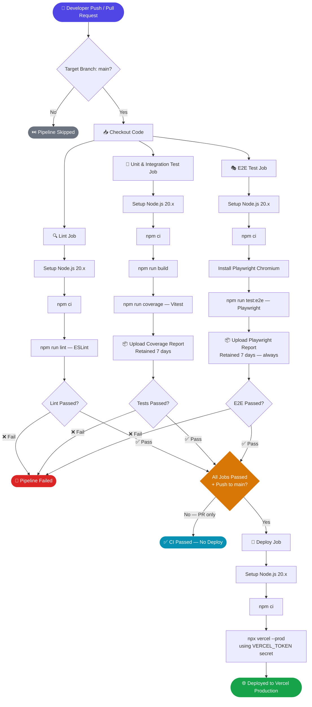
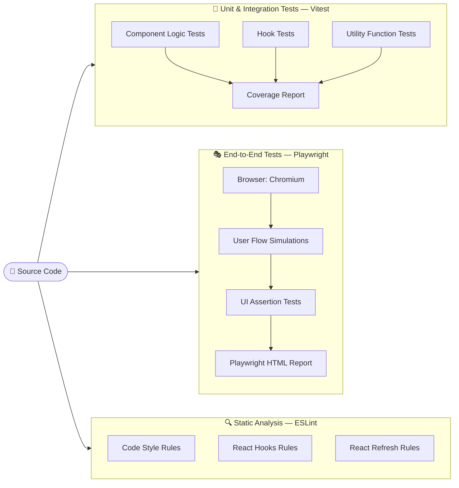
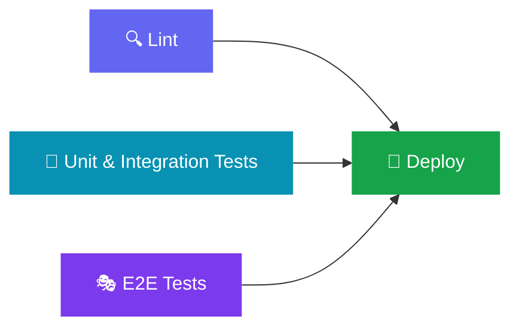

# CI/CD Pipeline & Testing Strategy

This document describes the Continuous Integration and Continuous Deployment (CI/CD) pipeline for **ci_cd_demo**, a React + Vite application.

---

## Pipeline Overview

The pipeline is triggered on every **push** or **pull request** to the `main` branch and runs four parallel jobs before deployment.

---

## Testing Layers

---

## Tools & Technologies

| Layer            | Tool                          | Command               | Artifact Uploaded       |
|------------------|-------------------------------|-----------------------|-------------------------|
| Linting          | ESLint 9                      | `npm run lint`        | —                       |
| Unit Tests       | Vitest + Testing Library      | `npm run coverage`    | `coverage/` (7 days)    |
| E2E Tests        | Playwright (Chromium)         | `npm run test:e2e`    | `playwright-report/` (7 days) |
| Build            | Vite 7                        | `npm run build`       | —                       |
| Deployment       | Vercel CLI                    | `npx vercel --prod`   | —                       |
| CI Runner        | GitHub Actions (ubuntu-latest)| —                     | —                       |
| Runtime          | Node.js 20.x                  | —                     | —                       |

---

## Job Dependency Graph

> **Deploy** only runs when **all three** jobs pass **and** the event is a push to `main`. Pull requests only run CI checks — no deploy.

---

## Trigger Rules

| Event               | Lint | Unit Tests | E2E Tests | Deploy |
|---------------------|:----:|:----------:|:---------:|:------:|
| Push → `main`       | ✅   | ✅         | ✅        | ✅     |
| PR → `main`         | ✅   | ✅         | ✅        | ❌     |
| Push → other branch | ❌   | ❌         | ❌        | ❌     |

---

## Secrets Required

| Secret Name          | Used By       | Purpose                        |
|----------------------|---------------|--------------------------------|
| `VERCEL_TOKEN`       | Deploy job    | Vercel CLI authentication      |
| `VERCEL_ORG_ID`      | Deploy job    | Identify Vercel organization   |
| `VERCEL_PROJECT_ID`  | Deploy job    | Identify Vercel project        |
